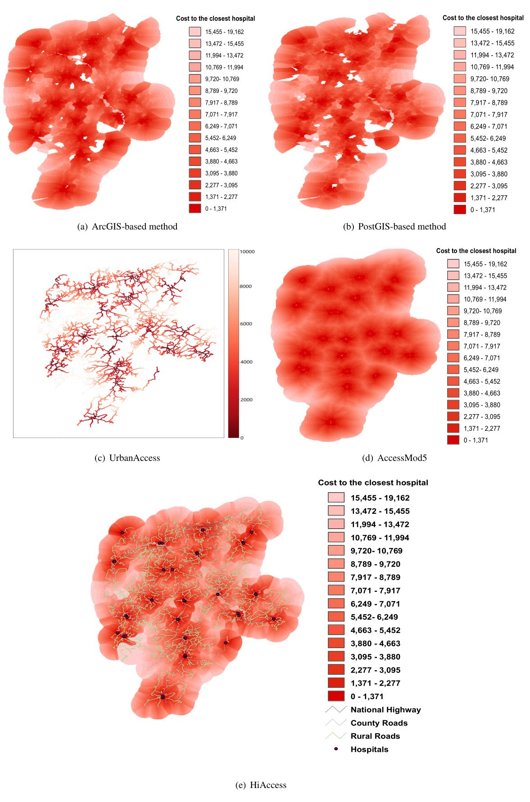
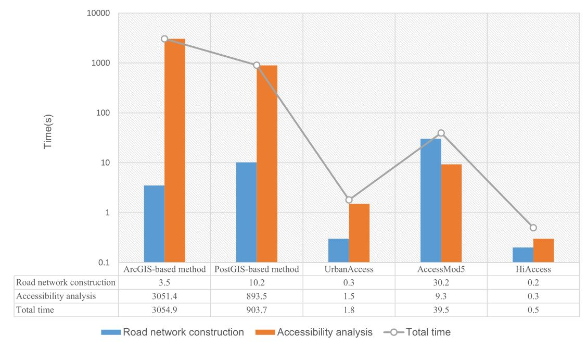
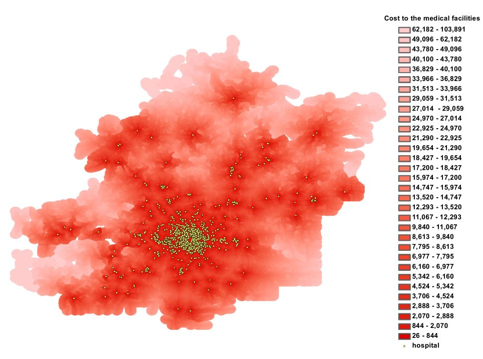
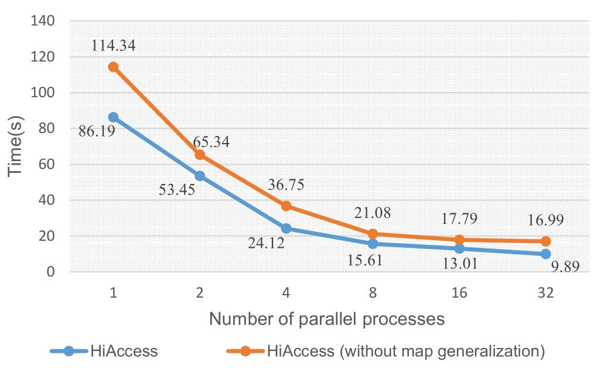

# HiAccess

## A parallel processing model for accelerating high-resolution geo-spatial accessibility analysis.

We present a parallel processing model, named HiAccess, to solve the high-resolution accessibility analysis problems in real time. One feature of HiAccess is a fast road network construction method, in which the road network topology is determined by traversing the original road nodes only once. The parallel strategies of HiAccess are fully optimized through theoretical analysis and experimental comparisons. Moreover, map generalization techniques are adopted to reduce computation load without accuracy loss. The flexibility of HiAccess enables it to work well when applied to different accessibility analysis models. HiAccess demonstrates the striking performance of measuring high-resolution (using 100m × 100m grids) accessibility of a city (in total over 250k grids, roads with 232k segments, 40 facilities) in 1 second without preprocessing, while ArcGIS takes nearly 1 hour to achieve a less satisfactory result. HiAccess is tested on much larger datasets with excellent performance.

The deployments of HiAccess using different accessibility analysis measurements:

**CDM**: Apply HiAccess to a distance-based measurement, namely, the closest-distance measurement.

**OBM**: Apply HiAccess to the opportunity-based measurement.

**CDMMG**: Use map generalization techniques to reduce computation of **CDM** without sacrificing accuracy.

**Other measurements**: To be continued...


## Usage

### Software dependencies:

[MPICH](http://www.mpich.org/) (recommended version 3.0.4)

[Boost C++ Libraries](https://www.boost.org/) (recommended version 1.64)

[Geospatial Data Abstraction Library (GDAL)](http://www.gdal.org/) >=2.0 (recommended version 2.1.2)

### Compile:

Make sure that the header and lib files of **Boost** and **GDAL** are included in the **Makefile**, then run the following command to generate the executable program:

> ```shell
> $ make clean && make
> ```

### Dataset:
Two test datasets are provided in the **data** folder:

***Tab1. dataset1***

| Name      | Type           | Size           |
| --------- | -------------- | -------------- |
| Road      | Road layer     | 16212 segments |
| Education | Facility layer | 298 points     |

***Tab2. dataset2***

| Name     | Type           | Size            |
| -------- | -------------- | --------------- |
| Road     | Road layer     | 265610 segments |
| Hospital | Facility layer | 59 points       |

### Run:

Parameters:

- `--road` Road_file: The road files are in [Shapefile Format](https://en.wikipedia.org/wiki/Shapefile). Multiple input road files are supported. For multiple road files, use comma as separation (e.g. `--road road1.shp,road2.shp.road3.shp` ). The road files should be in [Projection coordinate system](https://en.wikipedia.org/wiki/Geographic_coordinate_system) with meter as measurement unit.
- `--facility` Facility_file: The facility file is in [Shapefile Format](https://en.wikipedia.org/wiki/Shapefile). The facilities can be  jobs, health care, educational resources and so on. The facility file should be in [Projection coordinate system](https://en.wikipedia.org/wiki/Geographic_coordinate_system) with meter as measurement unit.
- `--resolution` R(meters): The resolution of accessibility analysis. It is the size of the grid.
- `--tolarence` T(meters): Snapping tolerance of disconnected edges.
- `--maxBound` B(meters): Off-road travel is taken into account, and maxBound is the maximum distance for an off-road point to road segments.
- `--rate` Rate: The ratio of off-road and road travel cost.
- `--output` out_tiff: Output file is in [GeoTIFF Format](https://en.wikipedia.org/wiki/GeoTIFF).

Examples:

> ```shell
> $ mpirun -np 4 ./CDM/facilityAccess  --road ./data/dataset1/roads.shp --facility ./data/dataset1/education.shp --resolution 100 --tolarence 10 --maxBound 3000 --rate 2 --output ./results/dataset1_100m_CDM.tif
> ```
>
> ```shell
> $ mpirun -np 4 ./CDMMG/facilityAccess  --road ./data/dataset1/roads.shp --facility ./data/dataset1/education.shp --resolution 100 --tolarence 10 --maxBound 3000 --rate 2 --output ./results/dataset1_100m_CDMMG.tif
> ```
>
> ```shell
> $ mpirun -np 4 ./OBM/facilityAccesscount  --road ./data/dataset1/roads.shp --facility ./data/dataset1/education.shp --resolution 100 --tolarence 10 --maxBound 3000 --rate 2 --output ./results/dataset1_100m_OBM.tif
> ```


## Performance:

We compare HiAccess with four representative accessibility analysis methods, namely, the GIS-based method (using [Network Analyst extension in ArcGIS](http://www.esri.com/software/arcgis/extensions/networkanalyst/)), the method based on spatial databases (using [PostGIS](http://postgis.net/) with [pgRouting](https://pgrouting.org/)), and two standalone accessibility analysis tools ([UrbanAccess](https://github.com/UDST/urbanaccess) and [AccessMod5](https://github.com/fxi/AccessMod_shiny)). We choose the roads and hospitals data of Huayuan county as test dataset(seeTab2). In the contrastive experiments, we use the closest-distance model for accessibility measurement. The experimental environment is shown in Tab 3. The computation time and accessibility results of the methods are shown in Fig1. and Fig 2. HiAccess has the best performance with the best accessibility analysis result among the methods. 

***Tab2. Roads and hospitals of Huayuan County***

| Name             | Type           | Size            |
| ---------------- | -------------- | --------------- |
| National Highway | Road layer     | 23646 segments  |
| County Road      | Road layer     | 632 segments    |
| Rural Road       | Road layer     | 205473 segments |
| Hospital         | Facility layer | 40 points       |


***Tab3.  Experimental environment***

| Item             | Description                                                  |
| ---------------- | ------------------------------------------------------------ |
| CPU              | 4core*2, Intel(R) Core(TM)i7-4700MQ@2.40GHz                  |
| Memory           | 16 GB                                                        |
| Software         | ArcGIS 10.2, PostgreSQL 9.5, PostGIS 2.2, pgRouting 2.3.2, UrbanAccess 0.1.0, AccessMod_shiny 1.1.1 |
| Operating System | Windows10, X86_64 for ArcGIS-based method.Ubuntu 16.04, X86_64 for PostGIS-based method, UrbanAccess and AccessMod5. |



*Fig1. Accessibility analysis results ( 100m × 100m grids) of hospitals in Huayuan county using different methods*




*Fig2. Computation time of the methods*


HiAccess can be used to solve high-resolution accessibility problems on large datasets. We apply HiAccess to the medical facilities accessibility analysis in Beijing, China, of which the dataset scale is much larger than that of Huayuan County. Accordingly, we use a Symmetrical Multi-Processing(SMP) server for experiments. The accessibility analysis results of medical facilities in Beijing is shown in Fig 3. As Fig 4 shows, we conduct a series of experiments to evaluate the parallel performance of HiAccess. With the increase of process numbers, HiAccess achieves high performance of parallel acceleration, which is approximate to linearity when the process number is below 8. The final results are produced in only 10 seconds using HiAccess with 32 processes. Additionally, the performance of HiAccess not using map generalization is also tested as a contrast. The results show that map generalization greatly reduces the computation time without sacrificing measurement accuracy.


***Tab4. Roads and medical facilities of Beijing from [OpenStreetMap](https://www.openstreetmap.org/).***

| Name             | Type           | Size             |
| ---------------- | -------------- | ---------------- |
| Beijing Road     | Road layer     | 1126123 segments |
| Medical facility | Facility layer | 1481 points      |


 ***Tab5. Experimental environment (SMP Server)***

| Item             | Description                               |
| ---------------- | ----------------------------------------- |
| CPU              | 32core*2, Intel(R) Xeon(R)E5-4620@2.20GHz |
| Memory           | 512 GB                                    |
| Operating System | CentOS 6.5                                |



*Fig3. Accessibility analysis results (100m × 100m grids) of medical facilities in Beijing*




*Fig4. Parallel performance of HiAccess*

## Citation: 

Ma M, Ye W, et al. A parallel processing model for accelerating high-resolution geo-spatial accessibility analysis[J]. IEEE ACCESS, 2018 DOI: 10.1109/ACCESS.2018.2870168

## Contact:

Mengyu Ma@ National University of Defense Technology
Email: mamengyu10@nudt.edu.cn
